# EKS Project — Production-Grade Kubernetes on AWS

A production-grade Kubernetes cluster on Amazon EKS, running IT-Tools over HTTPS with GitOps, monitoring, and full CI/CD automation.

**Live URL:** https://eks.ismaaeelahmed.co.uk *(demo — infrastructure destroyed after submission to avoid AWS charges)*

---

## Architecture

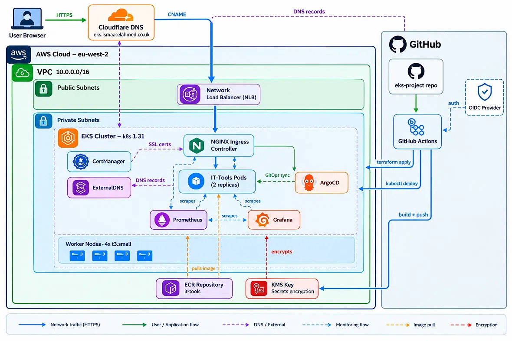

### Mermaid Version


---

## Project Board

Tracked progress via [GitHub Projects](https://github.com/users/ismaaeelahmed11/projects/1):

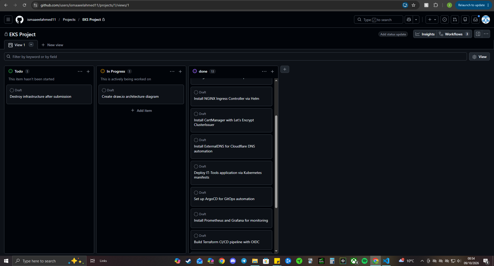

---

## Overview

| Component | What it does |
|-----------|-------------|
| **EKS Cluster** | Managed Kubernetes control plane (v1.31) |
| **Worker Nodes** | 4× t3.small EC2 instances in private subnets |
| **VPC** | Custom network with public (LB) and private (nodes) subnets |
| **NGINX Ingress** | Routes external HTTP/HTTPS traffic into the cluster |
| **CertManager** | Auto-issues SSL certificates from Let's Encrypt |
| **ExternalDNS** | Auto-creates DNS records in Cloudflare |
| **ArgoCD** | GitOps — syncs cluster state to Git |
| **Prometheus + Grafana** | Monitoring and dashboards |
| **IT-Tools** | The app — a collection of developer utilities |
| **GitHub Actions** | CI/CD for Terraform and app deployment |

---

## The Big Four

### What is this app?

**IT-Tools** is an open-source collection of handy utilities for developers — JSON formatters, hash generators, regex testers, subnet calculators, and 80+ other tools. It's a real production container used by thousands of developers.

I chose it because the EKS project focuses on **infrastructure and orchestration**, not app development. Deploying a real, useful container demonstrates platform engineering skills better than a custom "Hello World".

### Why this application?

- **Real production tool** — used by developers daily, not a toy demo
- **No database, no complexity** — pure infrastructure focus
- **Static web app** — easy to expose via Ingress + SSL
- **Lightweight** — small footprint, quick to scale
- **Realistic** — this is what you'd deploy in a real DevOps environment

### Why EKS? Why not ECS or a simpler option?

**Why not ECS:** I already built a production-grade ECS project earlier in the bootcamp — it taught me container orchestration at the service level. EKS is the natural next step: managed Kubernetes is the industry standard for orchestration at scale, and it teaches portable skills.

**Why not Vercel/Netlify:** They don't teach Kubernetes. This project is about learning production Kubernetes: Ingress, CertManager, ExternalDNS, ArgoCD, Prometheus, IRSA, and more.

**Why EKS specifically:**
- AWS-native managed Kubernetes — used in real DevOps roles
- Teaches portable skills (Kubernetes runs anywhere)
- Integrates cleanly with the rest of AWS (IAM, VPC, ECR)
- Prepares for multi-cloud and hybrid environments

### How many users are expected?

This is a portfolio project, so no real users. But the architecture is production-ready:

- **Multi-AZ** — 4 worker nodes across availability zones
- **2 replicas** of IT-Tools for high availability
- **Auto-sync + self-heal** via ArgoCD
- **Horizontal scaling** — bump replicas or add nodes as needed
- **HTTPS** with auto-renewing Let's Encrypt certs

If real traffic hit it, I'd increase replicas or node group size in Terraform. The platform is designed to scale.

---

## Project Structure

```
eks-project/
├── terraform/
│   ├── main.tf
│   ├── variables.tf
│   ├── outputs.tf
│   ├── provider.tf
│   ├── backend.tf
│   └── modules/
│       ├── vpc/
│       ├── eks/
│       ├── irsa/
│       └── oidc/
├── helm/
│   ├── ingress-nginx/
│   ├── cert-manager/
│   ├── external-dns/
│   ├── argocd/
│   └── monitoring/
├── k8s/
│   ├── namespace.yaml
│   ├── deployment.yaml
│   ├── service.yaml
│   ├── ingress.yaml
│   └── cluster-issuer.yaml
├── argocd/
│   └── applications/
│       └── it-tools.yaml
├── .github/
│   └── workflows/
│       ├── terraform-apply.yml
│       ├── terraform-destroy.yml
│       └── app-deploy.yml
├── screenshots/
├── docs/
└── README.md
```

---

## Getting Started

### Prerequisites

- AWS account with CLI configured
- Terraform 1.11+
- kubectl
- Helm 3+
- A domain in Cloudflare

### Deploy the infrastructure

```bash
cd terraform
terraform init
terraform plan
terraform apply
```

This creates:
- VPC with public and private subnets
- EKS cluster with managed node group
- IAM roles for EKS, nodes, GitHub Actions, EBS CSI

### Configure kubectl

```bash
aws eks update-kubeconfig --name eks-project-cluster --region eu-west-2
kubectl get nodes
```

### Install cluster add-ons

```bash
# NGINX Ingress
cd helm/ingress-nginx
helm install ingress-nginx ingress-nginx/ingress-nginx \
  --namespace ingress-nginx --create-namespace --values values.yaml

# CertManager
cd ../cert-manager
helm install cert-manager jetstack/cert-manager \
  --namespace cert-manager --create-namespace --values values.yaml

# ExternalDNS (requires Cloudflare API token secret)
kubectl create namespace external-dns
kubectl create secret generic cloudflare-api-token \
  --namespace external-dns --from-literal=api-token=YOUR_TOKEN
cd ../external-dns
helm install external-dns external-dns/external-dns \
  --namespace external-dns --values values.yaml
```

### Deploy the app

```bash
kubectl apply -f k8s/
```

### Set up ArgoCD

```bash
cd helm/argocd
helm install argocd argo/argo-cd \
  --namespace argocd --create-namespace --values values.yaml

kubectl apply -f argocd/applications/it-tools.yaml
```

### Install monitoring

```bash
cd helm/monitoring
helm install monitoring prometheus-community/kube-prometheus-stack \
  --namespace monitoring --create-namespace --values values.yaml
```

### Access the app

```
https://eks.ismaaeelahmed.co.uk
```

---

## CI/CD Pipelines

| Pipeline | Trigger | What it does |
|----------|---------|-------------|
| **Terraform Apply** | Push to `terraform/**` | Provisions EKS, VPC, IAM via OIDC |
| **Terraform Destroy** | Manual (confirm "destroy") | Tears down all infrastructure |
| **App Build, Scan & Deploy** | Push to `k8s/**` | Checkov scan → Trivy scan → push ECR → deploy to EKS |

All pipelines use **OIDC** — no static AWS keys.

---

## What I Learned

- **EKS architecture** — control plane vs worker nodes, managed node groups
- **IRSA** (IAM Roles for Service Accounts) — pods assuming AWS roles via OIDC
- **Ingress + CertManager + ExternalDNS** — the trio that automates external access
- **GitOps with ArgoCD** — cluster state follows Git, self-heals drift
- **Prometheus + Grafana** — real observability with custom dashboards
- **OIDC authentication** — no more static AWS credentials in CI/CD
- **Node capacity planning** — t3.small limits, EBS CSI driver, pod scheduling
- **Debugging EKS** — access entries, kubectl auth, PVC binding

---

## Troubleshooting Journey

**Issue 1: Container port conflicts**
Non-root containers can't bind to privileged ports. Fixed by using 8080 for the container and 443 at the load balancer.

**Issue 2: OIDC trust policy**
GitHub's immutable subject claims broke the trust policy. Fixed by adding both old and new formats to `sub` conditions.

**Issue 3: Pods stuck Pending**
Node capacity limit on t3.small (~11 pods per node). Fixed by scaling to 4 nodes.

**Issue 4: PVCs stuck Pending**
EBS CSI driver wasn't installed. Then it crashed without an IAM role. Fixed by adding IRSA + the driver as an EKS add-on.

**Issue 5: EKS access entries conflict**
Module's `cluster_creator` auto-admin clashed with explicit access entries. Fixed by disabling auto-admin and managing entries explicitly.

---

## Cost Management

EKS is expensive to run continuously:

- Control plane: ~$2.40/day
- 4× t3.small nodes: ~$2.40/day
- NAT Gateway: ~$1.08/day
- Load balancer: ~$0.50/day
- **Total: ~$6.50/day (~£45/week)**

Destroyed after submission. Screenshots and code preserved in this repo.

---

## Screenshots

### 1. Project Structure
Initial repo layout — Terraform modules, Helm folders, K8s manifests, CI/CD workflow folders, and docs.

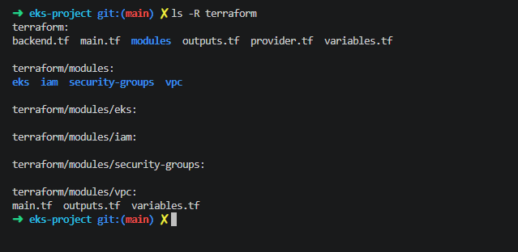

### 2. S3 Remote State
Terraform state bucket with versioning, encryption, and public access blocked. This is where the state file lives — shared between my laptop and GitHub Actions.

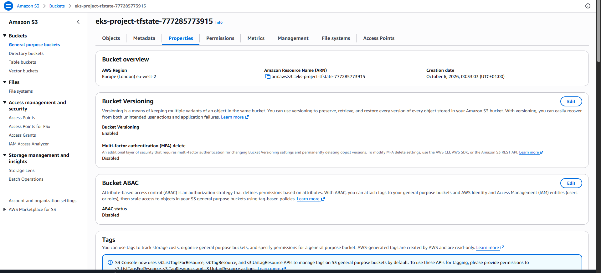

### 3. Terraform Initialised
Backend connected to S3, AWS provider downloaded, VPC module loaded. Everything ready for the first plan.

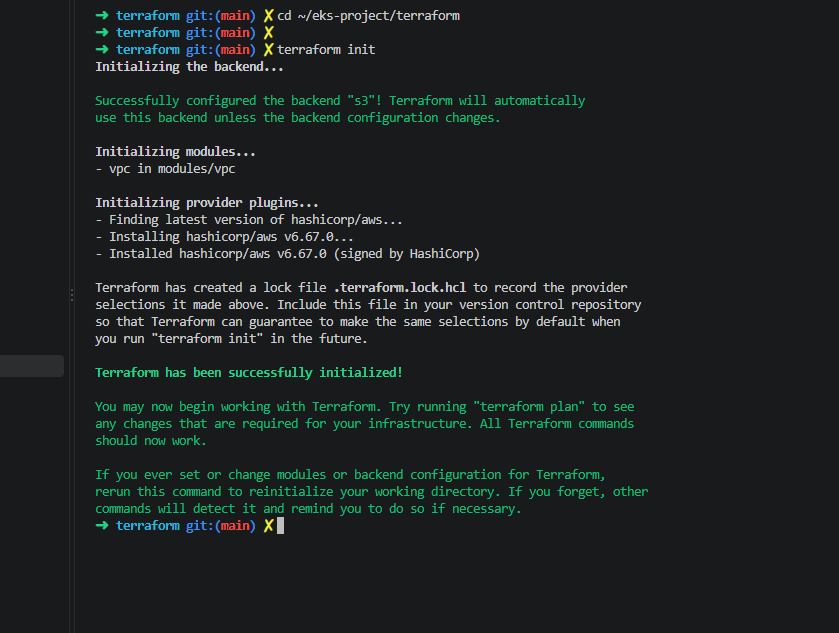

### 4. Terraform Plan — VPC
14 resources to create: VPC, 2 public subnets, 2 private subnets, Internet Gateway, NAT Gateway, Elastic IP, 2 route tables, 4 route table associations.

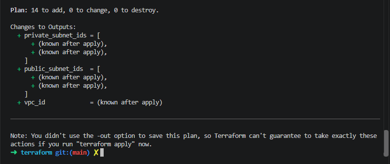

### 5. Terraform Apply — VPC
All 14 resources created. VPC ID and subnet IDs printed as outputs — these feed into the EKS module.

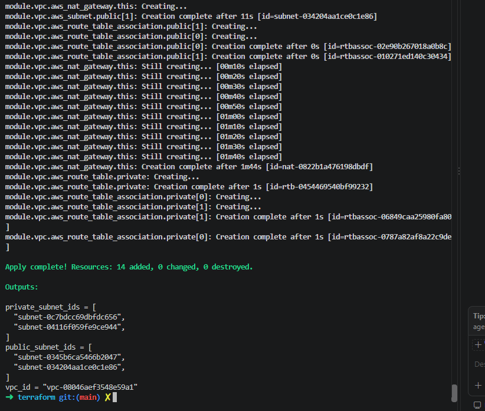

### 6. Terraform Plan — EKS
33 resources to add. This includes the EKS control plane, managed node group, IAM roles, security groups, KMS key, OIDC provider, and essential add-ons (CoreDNS, kube-proxy, VPC CNI).

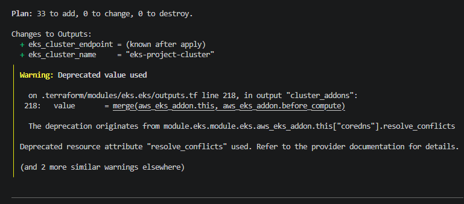

### 7. Terraform Apply — EKS
EKS cluster and node group created. Cluster endpoint and name printed as outputs. The apply takes ~15 minutes because AWS provisions the control plane in the background.

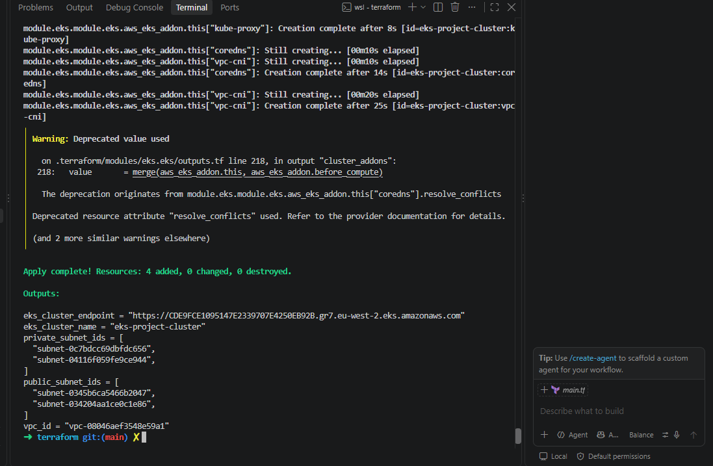

### 8. EKS Nodes Running
`kubectl get nodes` showing 4 worker nodes in Ready state, running Kubernetes v1.31.14. These nodes are spread across availability zones for resilience.

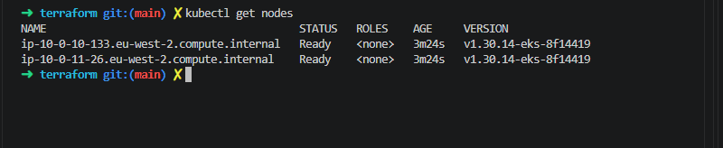

### 9. NGINX Ingress Installed
NGINX Ingress Controller deployed via Helm. AWS automatically provisioned a Network Load Balancer (visible in the EXTERNAL-IP column). This is the entry point for external traffic.

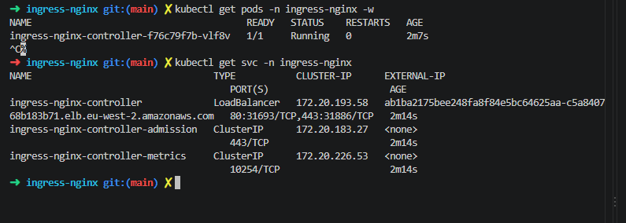

### 10. CertManager Installed
All three CertManager pods running: the main controller, the CA injector, and the webhook. CertManager watches Ingress resources and requests SSL certificates from Let's Encrypt automatically.

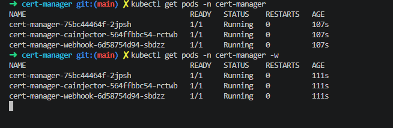

### 11. ClusterIssuer Ready
The Let's Encrypt ClusterIssuer is Ready. This tells CertManager how to authenticate with Let's Encrypt using HTTP-01 challenges — NGINX Ingress serves the challenge file on port 80.

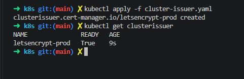

### 12. ExternalDNS Installed
ExternalDNS pod running. It watches Kubernetes Ingress resources and automatically creates DNS records in Cloudflare — no more manual DNS updates.

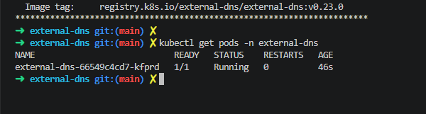

### 13. IT-Tools Pushed to ECR
Pulled the official IT-Tools image from Docker Hub, retagged it for ECR, and pushed it. Now EKS can pull it from our private registry instead of Docker Hub.

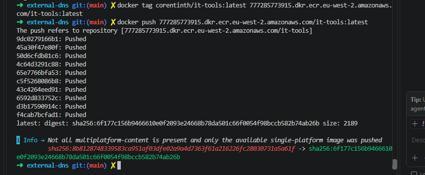

### 14. IT-Tools Deployed
All resources created: 2 IT-Tools pods Running, ClusterIP service, and Ingress with the host `eks.ismaaeelahmed.co.uk`. CertManager is already spinning up a pod to validate domain ownership.

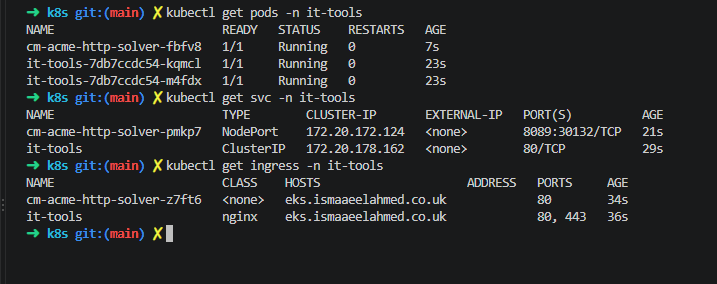

### 15. HTTPS Live
IT-Tools running at `https://eks.ismaaeelahmed.co.uk` with a valid Let's Encrypt certificate. The padlock shows the SSL certificate was issued and trusted automatically.

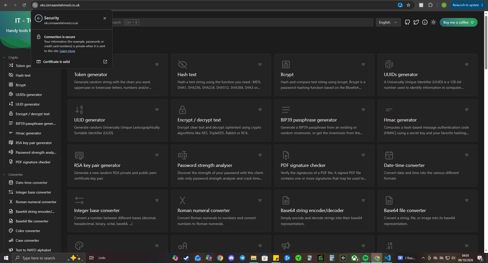

### 16. Terraform Apply Pipeline Green
The Terraform Apply GitHub Actions pipeline succeeded. It uses OIDC to assume an AWS role — no static keys — and runs `terraform plan` followed by `terraform apply` on every push to `terraform/**`.

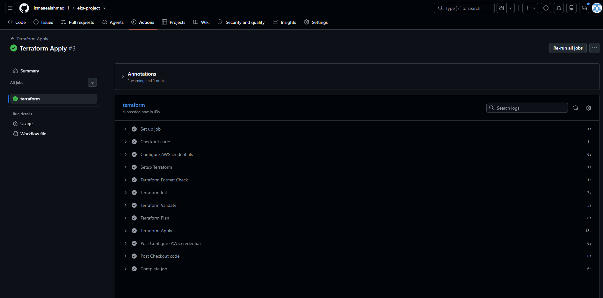

### 17. OIDC Trust Policy
The GitHub Actions IAM role's trust policy. It accepts both the classic subject claim (`repo:owner/name:*`) and the newer immutable format with numeric IDs — needed because GitHub changed how they issue OIDC tokens.

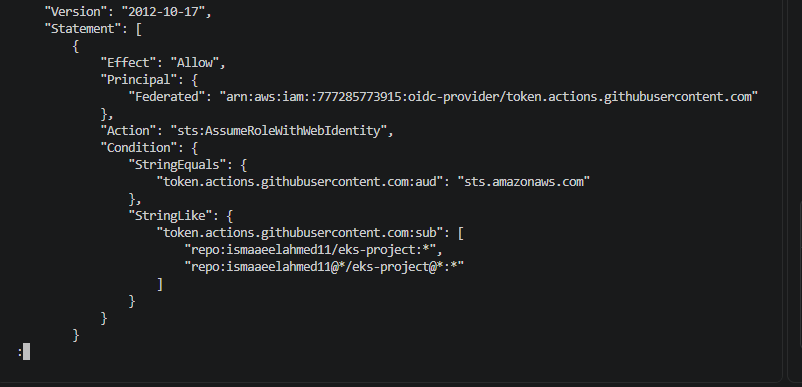

### 18. App Deploy Pipeline Green
The App Build, Scan & Deploy pipeline. Two jobs: **Checkov** (scans Terraform for security issues) and **build-and-deploy** (Trivy scans the image, pushes to ECR, deploys to EKS via kubectl). Both green.

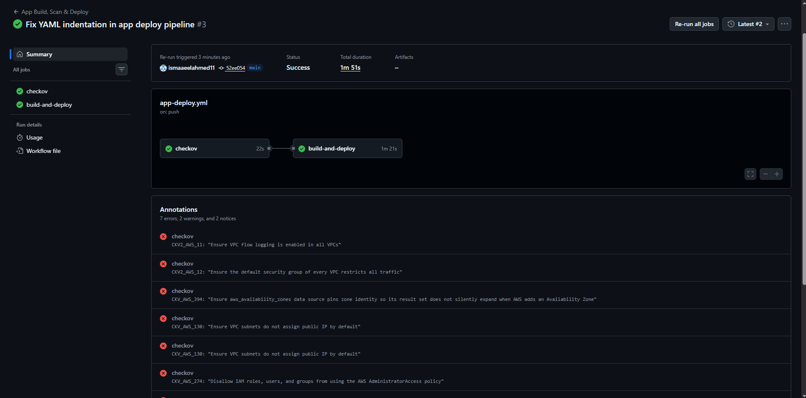

### 19. ArgoCD Installed
All ArgoCD pods running in the `argocd` namespace: application controller, appset controller, dex server, notifications controller, Redis, repo server, and the main API server.

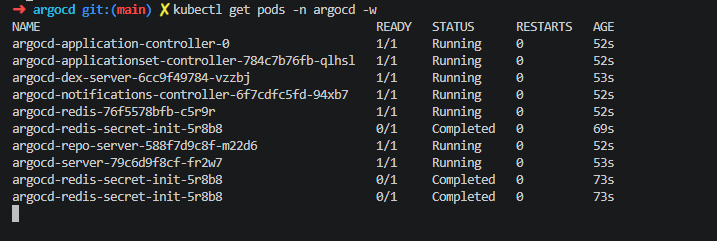

### 20. ArgoCD Synced
The `it-tools` Application is Synced and Healthy. ArgoCD watches the `k8s/` folder in the repo and reconciles cluster state automatically. Any change pushed to Git gets applied within 3 minutes.

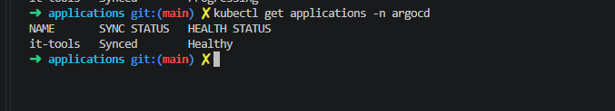

### 21. ArgoCD UI — GitOps Tree
The ArgoCD visual tree: namespace → service → deployment → replicaset → 2 running pods. Also shows the Ingress, ClusterIssuer, and the issued TLS certificate. This is what GitOps looks like in action.

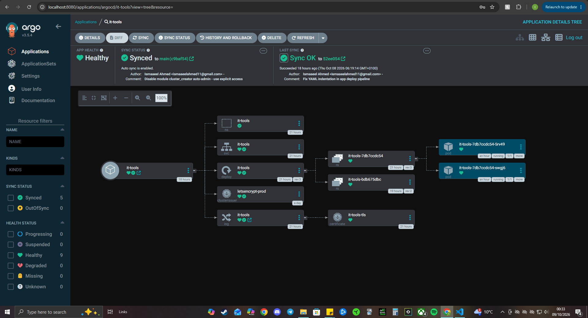

### 22. Monitoring Debug — Pending Pods
Initial monitoring install failed. Alertmanager, Grafana, and Prometheus pods stuck Pending. Root cause: EBS CSI driver wasn't installed, so PVCs couldn't bind.

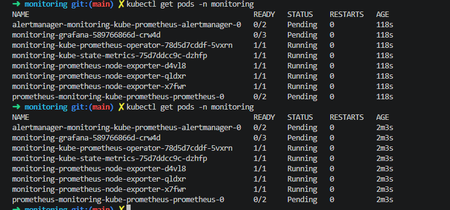

### 23. Monitoring Running
After installing the EBS CSI driver, adding IRSA for it, and scaling nodes to 4× t3.small, all monitoring pods are Running. Prometheus, Grafana, Alertmanager, and node exporters.

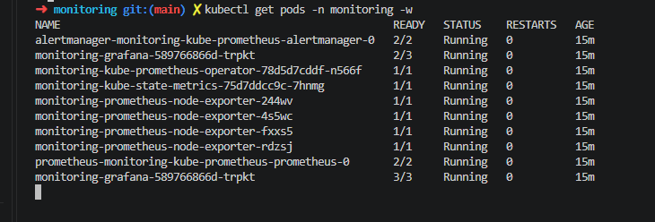

### 24. Grafana Dashboard
Grafana showing live Kubernetes cluster metrics: CPU utilisation (3.54%), memory utilisation (52.1%), per-namespace breakdown (monitoring, argocd, cert-manager, kube-system, it-tools), and live resource charts.

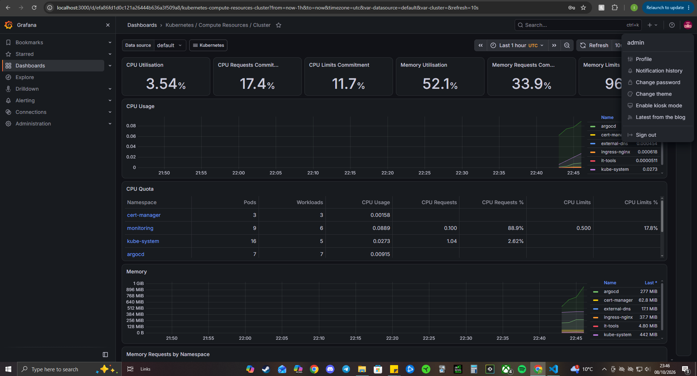

### 25. Project Board
GitHub Projects board tracking all tasks. Todo, In Progress, and Done columns show the full project breakdown — from VPC setup to Prometheus installation to README.


---

*Built with Terraform, Helm, EKS, ArgoCD, Prometheus, and GitHub Actions.*